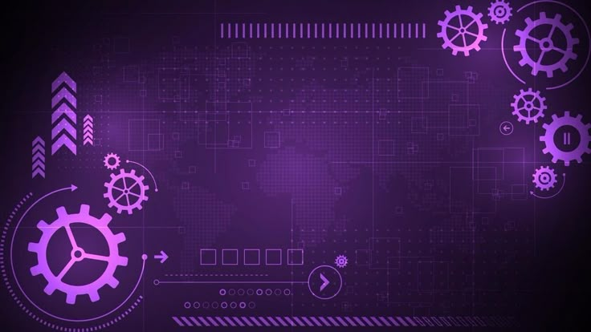

<!--  -->

 

# 👋 Hi, I'm Savitha S

### CSE UNDERGRADUATE | JAVA | FULL STACK | SOFTWARE DEVELOPMENT

 

---

## `01` — About

I'm a **Final-Year Computer Science Engineering undergraduate** with a strong interest in **Java, Data Structures & Algorithms, Full Stack Development, and Artificial Intelligence**.

I enjoy solving programming problems, building practical applications, and exploring technologies that can turn real-world ideas into useful software solutions.

Currently, I'm strengthening my **Java and DSA skills** while expanding my knowledge of **Spring Boot, React.js, Python, RAG, and AI-powered applications**.

### Core Skills

* ☕ **Java** — Programming, OOP & problem solving
* 🧩 **Data Structures & Algorithms** — Coding practice & logical thinking
* 🐍 **Python** — Programming & AI applications
* 🌐 **HTML/CSS/JavaScript** — Web development fundamentals
* ⚛️ **React.js** — Frontend development
* 🗄️ **SQL / MySQL** — Database fundamentals
* 🔧 **Git & GitHub** — Version control & project management
* 🤖 **RAG / AI** — Retrieval-based intelligent applications

### Currently Learning

`Spring Boot` · `RAG` · `AI Agents` · `ChromaDB` · `System Design`

### Areas of Interest

`Full Stack Development` · `AI & Generative AI` · `Java Software Development` · `Problem Solving`

---

## `02` — Tech Stack

### 💻 Languages

### 🎨 Frontend

### ⚙️ Backend & Databases

### 🛠️ Tools & Platforms

### 🎯 Areas of Interest

---

## `03` — Featured Projects

### 🤖 AI-Powered Enterprise IT Helpdesk Agent

An **AI-powered enterprise IT support platform** designed to help employees troubleshoot technical issues using an approved company knowledge base.

The system combines **Retrieval-Augmented Generation, vector search, AI assistance, and automated ticket management** to provide reliable IT support.

**Key Features:**

* 🔎 Knowledge-base powered question answering
* 🧠 Retrieval-Augmented Generation
* 🗃️ ChromaDB vector search
* 🎫 Automatic ticket creation and escalation
* 🚦 Issue classification and priority suggestion
* 👥 Employee, IT Staff & Admin roles
* 🔐 JWT authentication & role-based access
* 📊 IT support dashboards
* 💬 AI-powered troubleshooting assistant

**Technologies:** `Java` `Spring Boot` `React.js` `MySQL` `ChromaDB` `RAG`

---

### ♻️ Smart Waste Recycling System

A **smart waste management and recycling platform** integrated with IoT-enabled dustbins for apartment complexes.

The system monitors waste levels and provides alerts when bins require collection, helping improve waste collection and recycling management.

**Key Features:**

* 🗑️ IoT-enabled smart dustbins
* 📡 Ultrasonic sensor-based monitoring
* 📊 Waste monitoring dashboard
* 🟢🟡🔴 Color-coded bin status
* 🔔 Full-bin notifications
* 👷 Collector assignment
* 🗺️ Route optimization
* 📍 Live map tracking

**Technologies:** `React.js` `Node.js` `Express.js` `MongoDB` `ESP8266` `HC-SR04`

---

## `04` — LeetCode Journey

I use coding platforms to strengthen my **problem-solving ability, Java programming, and DSA fundamentals**.

### 🧩 DSA Topics

`Arrays` · `Strings` · `Sliding Window` · `Stack` · `Queue`

`Linked List` · `Trees` · `Graphs` · `Recursion` · `Dynamic Programming`

 

---

## `05` — GitHub Activity

---

## `06` — GitHub Stats

---

## `07` — Connect

---

### **Learning. Building. Solving. One problem at a time. 💜**

